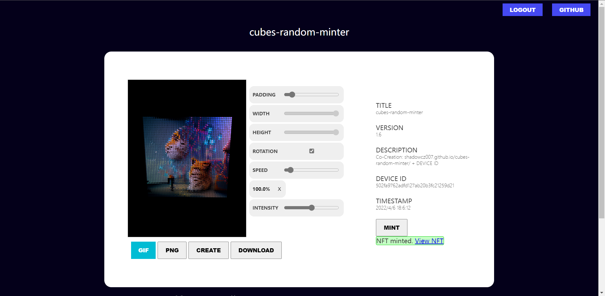
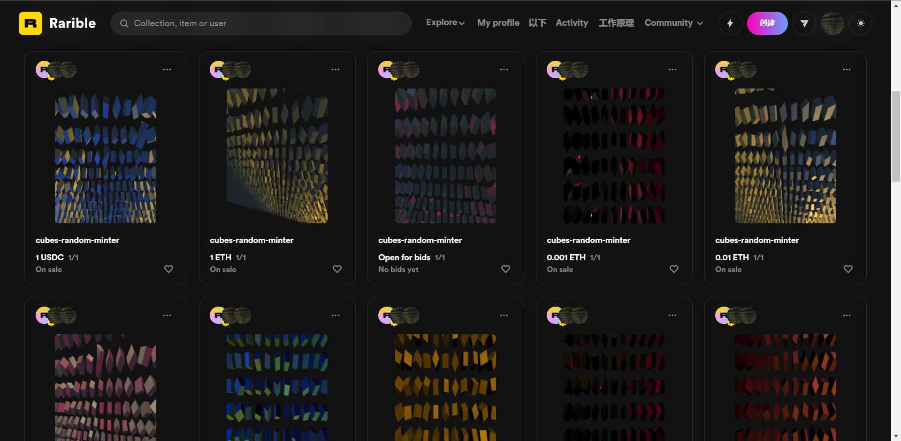

# [cubes-random-minter](https://shadowcz007.github.io/cubes-random-minter/index.html)
- Everyone is an artist，3D generative art NFT minter dapp

- 人人都是艺术家，使用moralis的rarible插件完成的dapp应用。使用生成艺术、用户与机器共创（反复点击图片即可生成新的结果）、使用lazy-mint，无gas费即可上架。

# features
- 3D generative art

3D generative art NFT minter dapp built with Moralis, Rarible Plugin and Javascript

- co-creation

Switch to the Ethereum mainnet, and then tap on the image, when the animation stops, you can choose whether you want mint, click on the image repeatedly, get different generation results.

- lazy-mint

Using the lazi-mint way, it can be listed without gas fees.

# exmaple

[rarible link](https://rarible.com/token/0xf6793da657495ffeff9ee6350824910abc21356c:37268655778482429449284118906968186200180468563238146401157742791608739299342?tab=details)

## Support
- [Discord](https://discord.gg/x7GsmuTQjV)

## License

